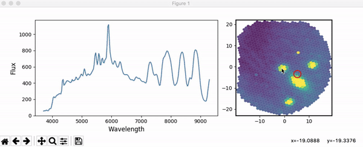

# pysedm
Data Reduction Pipeline for the SEDmachine. Please have a look at [the pysedm paper](http://adsabs.harvard.edu/abs/2019arXiv190208526R).

[](https://pypi.python.org/pypi/pysedm)

_works in python 2.7+ and 3.x, but the 2.7+ might not be supported in the future._

### Acknowledgements

This project was funded by the European Research Council (ERC) under the European Union's Horizon 2020 research and innovation programme (grant agreement n°759194 - USNAC, PI: Rigault).

## Reference

If you are using a SEDM spectrum obtained since July 2018 (incl.) please cite [the pysedm paper](http://adsabs.harvard.edu/abs/2019arXiv190208526R) 


# Installation

```bash
pip install pysedm
```

or 
```bash
git pull https://github.com/MickaelRigault/pysedm.git
cd pysedm
python setup.py install
```


Basic installation detailed here enables you to:
- *load*, *visualize* and *use* pysedm product objects (spectra, cubes, but also calibration objects)
- *extract* spectra from cubes. 

***
# Running a manual spectral extraction (from the shell)

Here is are some examples to use `pysedm`. 

## Open and display a Cube.

Say you have a cubefile name `e3d_crr_date_fileid_ztfname.fits`

```python
import pysedm
# Load the cube
cube = pysedm.get_sedmcube('e3d_crr_date_fileid_ztfname.fits')
# See the cube and enable to clic on the cube to visualize spaxels:
cube.show(interactive=True)
```


_**what is going on?** if you click on spaxels you see the spaxel spectra on the left. If you click once on "**control**" you will not replace the spectrum on the left but **see new spaxel's spectra with a new color** (colors match bewtween spaxel contours and spectra. Click once again on "control" to turns this off. 
If you **drag your mouse on the IFU**, the display spectrum will be the average of the rectangle defined by the draging. Click on **"shift" to draw any polygon**. Click again on "shift" to turns it off. Click on **"option"and your dragging will define an aperture radius**. Click on **"escape" to clean everything switch back to original mode**_ 

You can directly display the cube without opening ipython by doing:
```bash
display_cube.py e3d_crr_date_id_ztfname.fits
```

## Manual cube extraction.

You want to manually extract a spectrum from a cube `e3d_crr_date_fileid_ztfname.fits` (`fileid` is HH_MM_SS)

From your shell do (with date been YYYYMMDD):
```bash
extract_star.py DATE --auto FILE_ID --display
```


_**what is going on?** (1) double click to locate the expected centroid of the target (creating the  black cross) and (2) click and "shift" and draw a countour avoiding the host. The contours should be a ~5 spaxels large if possible. Finally (3) close the window to launch the PSF extraction. This will happen in your terminal_

**Flux Calibration** if you want your extracted spectra to be flux calibrated, you need to have a `fluxcal` file in your DATE directory. You can also directly provide your favorite fluxcal file as an option to `extract_star.py`: 

```bash
extract_star.py DATE --auto FILE_ID --display --tag manual --fluxcalsource your_favorite_fluxcal.fits
```

Some other important `extract_star.py` options:
- "--tag": provide a string, this string will be in the name. Useful to avoid overwriting existing files, i.e. `--tag host`
- "--observer": Your name, this will be stored in the header as "OBSERVER"
- "--vmin", "--vmax": lower and upper values (in percent) of the MLA spaxel plot (`--vmax 80` to saturate the color at the 80% brightest spaxel signal)


### Output Data
`extract_star.py` creates several files (see `*_auto_*crr_date_fileid_ztfname.fits`). Most interesting ones are:

- `spec_auto...`: extracted spectrum with formats .fits or .txt (and figures in .png/.pdf)
   
   
   
- `psfprofile...`: figure showing the quality of the PSF extraction
   
   
   
- `adr_fit...`: figure showing the quality of the ADR (i.e. target centroid as a function of wavelength)
   
   
   
***
# Interactive 3D psf extraction (from notebook or any python code)

Starting with version `0.24.0` you can directly extract a point source from a `SEDMCube`.

Simply do:
```python
import pysedm
cube = pysedm.get_sedmcube(CUBE_FILEPATH)
cube.extract_pointsource() # runs extractstars creating a cube.extractstar
```
Then, to get the flux calibrated spectrum, do:
```python
spectrum = cube.extractstar.get_fluxcalibrated_spectrum()
```
And to see the validation plots: 
- `cube.extractstar.show_mla()` ; centroid and spaxel used
- `cube.extractstar.show_adr()` ; adr fit quality
- `cube.extractstar.show_psf()` ; psf profile


***
# pysedm in details:

See library details [here](pysedm)
  


***
# Dependencies

The following dependencies are automatically installed (if needed only):

- _numpy_, _scipy_, _matpotlib_, _astropy_ (basic anaconda)

- _propobject_ (pip install propobject) _for the structure of the classes_

- _pyifu_ (pip install pyifu or see https://github.com/MickaelRigault/pyifu) _cube and spectra object library_

- _psfcube_ (pip install psfcube or see https://github.com/MickaelRigault/psfcube) 
  _psfcube depends on Minuit (fitter) and modefit (structure), which are automatically installed if needed_


See details [here](pysedm) for additional dependencies you will need for full pipeline functionalities (like re-creating the wavelength solution etc.)
